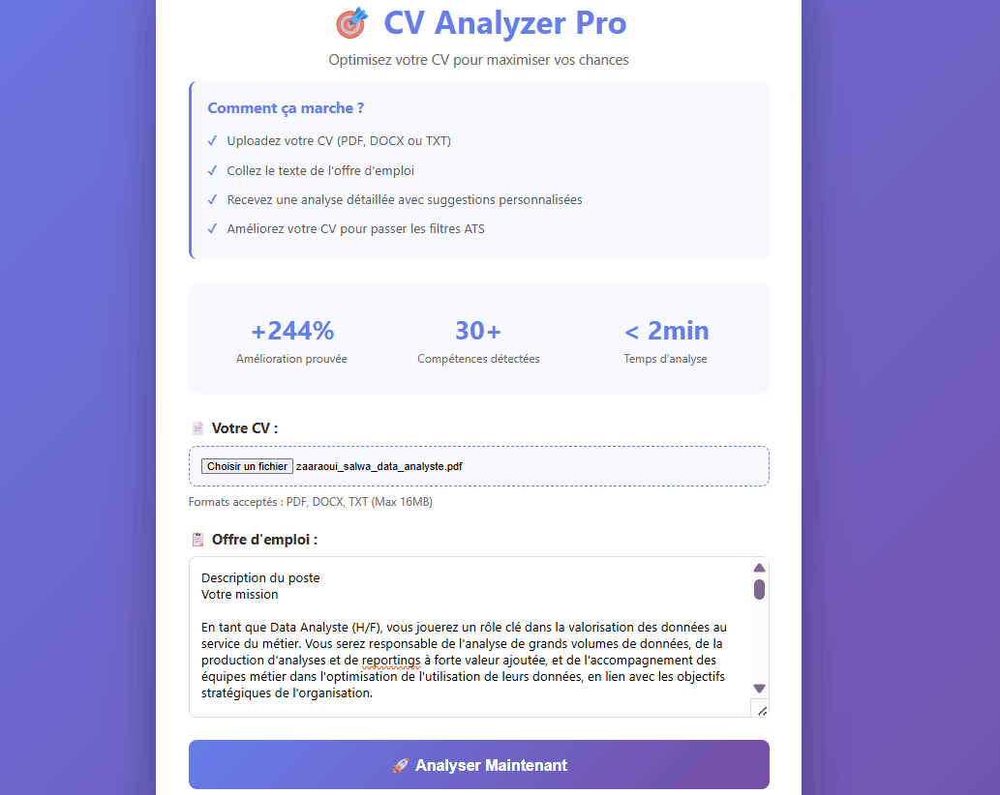
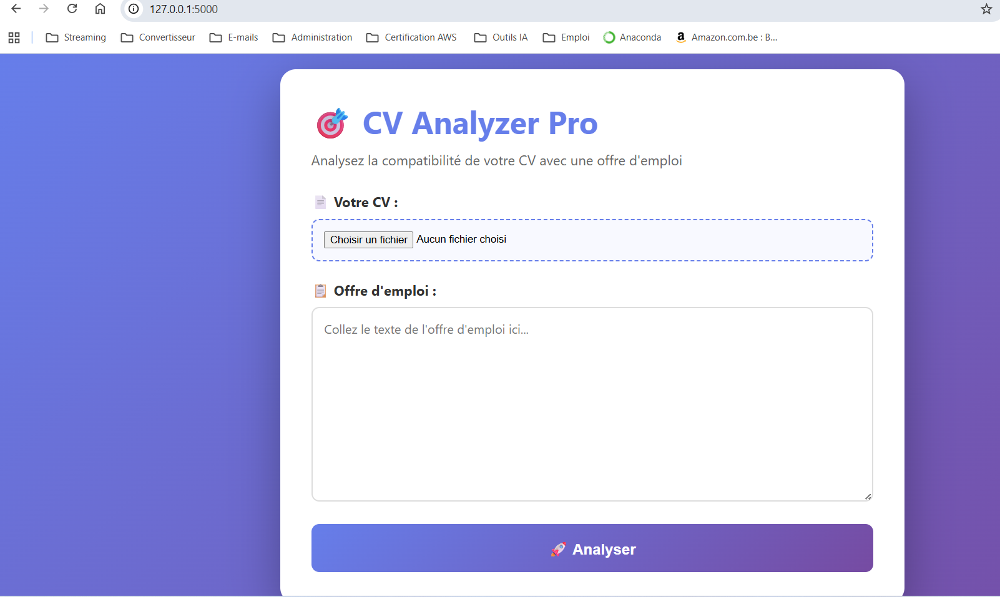
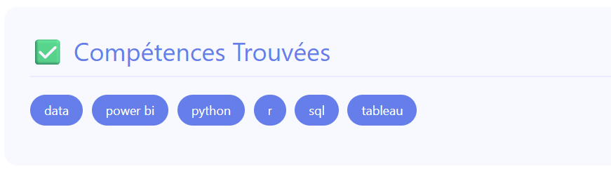
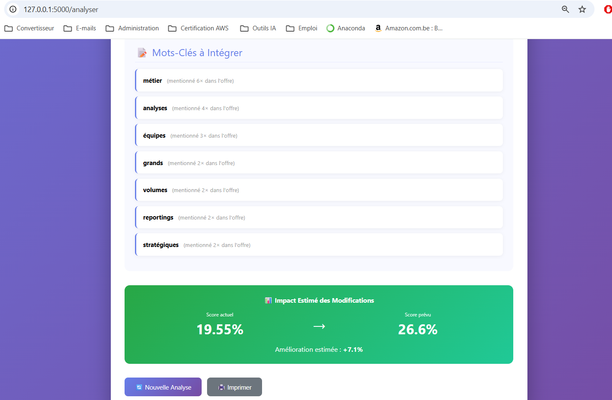
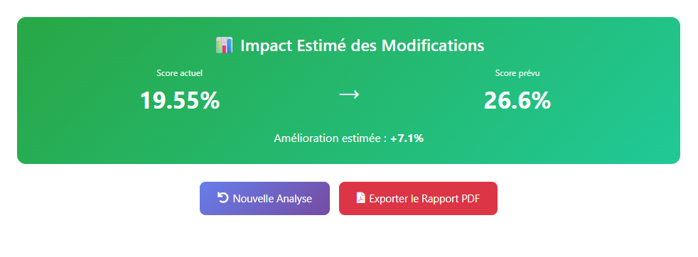

# 🎯 CV Analyzer - Analyseur de CV Intelligent


[](http://cv-analyzer-pro-env.eba-xf2mxuyb.eu-north-1.elasticbeanstalk.com)
[](http://cv-analyzer-pro-env.eba-xf2mxuyb.eu-north-1.elasticbeanstalk.com)

## 🌐 Démo en ligne

**Testez l'application sans installation :**
👉 **[cv-analyzer-pro-env.eba-xf2mxuyb.eu-north-1.elasticbeanstalk.com](http://cv-analyzer-pro-env.eba-xf2mxuyb.eu-north-1.elasticbeanstalk.com)**

Une application web Flask qui analyse la compatibilité entre un CV et une offre d'emploi en utilisant le traitement du langage naturel (NLP).



## ✨ Fonctionnalités

- 📊 **Score de compatibilité** : Calcul du pourcentage de match CV/offre
- 🎯 **Détection de compétences** : Identification automatique des compétences clés
- 📈 **Analyse de mots-clés** : Comparaison détaillée du vocabulaire
- 💡 **Suggestions d'amélioration** : Recommandations personnalisées
- 💾 **Export PDF de Rapport** : Génération d'un rapport complet et téléchargeable pour un suivi hors ligne.
- 🎨 **Interface moderne** : Design professionnel et responsive

## 🛠️ Technologies utilisées

- **Backend** : Flask (Python)
- **NLP** : Scikit-learn (TF-IDF, Cosine Similarity)
- **Frontend** : HTML5, CSS3
- **Analyse** : Regex, tokenization
- **Rapport** : ReportLab (PDF Generation)

## 📸 Captures d'écran

### Page d'accueil


### Compétences détectées


### Tableau de suggestions


### Export PDF

## 🚀 Installation

### Prérequis
- Python 3.8+
- pip

### Étapes

1. **Clone le repository**
```bash
git clone [https://github.com/slw-z/cv-analyzer-flask.git](https://github.com/slw-z/cv-analyzer-flask.git)
cd cv-analyzer-flask

2. **Crée un environnement virtuel**
```bash
python -m venv venv
source venv/bin/activate  # Sur Windows: venv\Scripts\activate
```

3. **Installe les dépendances**
```bash
pip install -r requirements.txt
```

4. **Lance l'application**
```bash
python app.py
```

5. **Ouvre ton navigateur**
```
http://localhost:5000
```

## 💡 Comment utiliser

1. Colle le texte de ton CV dans le premier champ
2. Colle le texte de l'offre d'emploi dans le second champ
3. Clique sur "Analyser"
4. Consulte le score, les compétences détectées et les suggestions

## 📊 Interprétation des scores

| Score | Interprétation |
|-------|---------------|
| < 10% | Match faible - CV à retravailler |
| 10-15% | Match acceptable - Profil junior valable |
| 15-20% | Bon match - Postulez avec confiance |
| > 20% | Excellent match - Profil très aligné |

## 🎯 Algorithme

L'application utilise :
- **TF-IDF** (Term Frequency-Inverse Document Frequency) pour vectoriser les textes
- **Similarité cosinus** pour calculer le score de compatibilité
- **Extraction par regex** pour détecter les compétences techniques
- **Analyse de fréquence** pour identifier les mots-clés importants

## 🔮 Prochaines fonctionnalités

- [ ] Déploiement sur AWS
- [ ] API REST
- [ ] Version mobile (Flutter)
- [ ] Support multi-langues

## 👩‍💻 Auteur

Salwa Zaaraoui

🌐 LinkedIn : linkedin.com/in/salwa-zaaraoui
📧 Courriel : zaaraoui.salwa@live.fr
💼 Portefeuille : IA/ML

## 📝 Licence

Ce projet est sous licence MIT.

---

⭐ Si ce projet t'a aidé, n'hésite pas à lui mettre une étoile !"# cv-analyzer-flask" 
